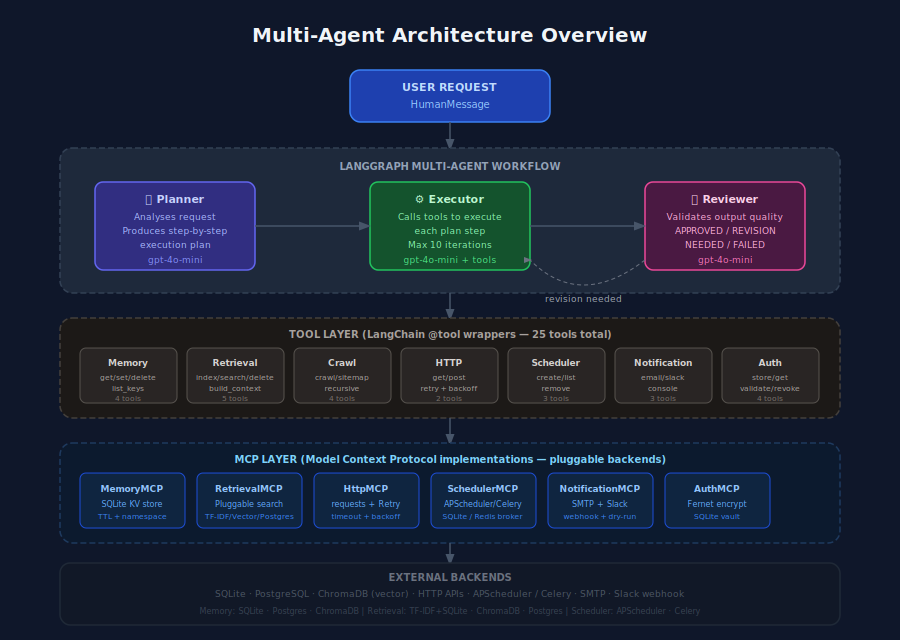
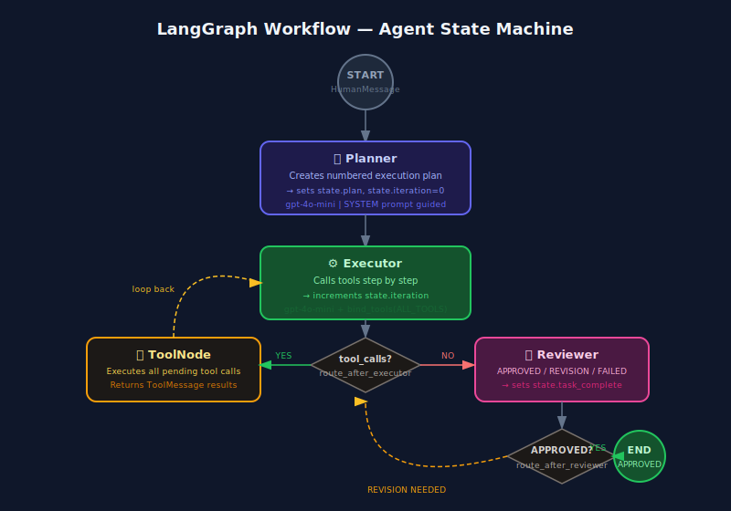
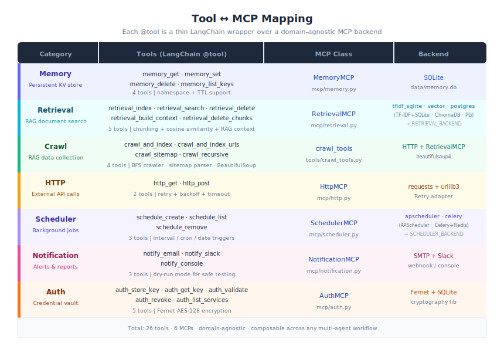
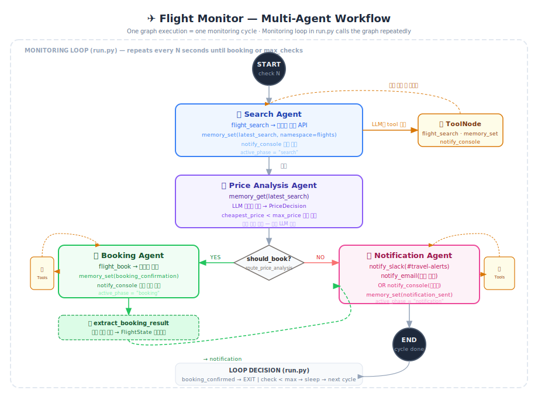

# Agentic AI Project

도메인에 관계없이 멀티 에이전트 아키텍처에서 재사용할 수 있는 **공통 Tool 및 MCP(Model Context Protocol)** 구현체와, 이를 조합하여 실제 사용 사례를 보여주는 예시 시나리오로 구성된 프레임워크입니다.


> Agentic AI의 핵심 구성 요소 — LLM + Tools + Memory + Evaluation + Loop.  
> 이 프로젝트는 위 개념을 **LangGraph + MCP** 기반으로 실제 구현한 것입니다.

---

## Architecture Overview



### 3-Layer Design

| Layer | 역할 | 구성 요소 |
|-------|------|-----------|
| **Multi-Agent Graph** | LLM 에이전트들이 협력하여 작업 수행 | Planner → Executor → Reviewer |
| **Tool Layer** | LLM이 호출 가능한 LangChain `@tool` 래퍼 | 25개 도메인-독립 tool |
| **MCP Layer** | 실제 백엔드 시스템과 연결되는 구현체 | 6개 MCP 클래스 (플러그인 백엔드) |

---

## LangGraph Workflow



```
START
  │
  ▼
┌─────────────┐       ┌──────────────┐       ┌──────────────┐
│   Planner   │──────▶│   Executor   │──────▶│   Reviewer   │
│  (계획 수립) │       │  (도구 실행)  │◀──────│  (품질 검증)  │
└─────────────┘       │      ↕       │  rev. └──────┬───────┘
                      │  ToolNode    │              │ approved
                      └──────────────┘              ▼
                                                   END
```

- **Planner**: 사용자 요청을 분석하여 번호 매긴 실행 계획 생성
- **Executor**: 계획 순서대로 tool을 호출하여 작업 실행 (max 10 iterations)
- **Reviewer**: 실행 결과를 검토하여 APPROVED / REVISION NEEDED / FAILED 판정
- **ToolNode**: Executor의 `tool_calls`를 자동으로 실행하고 결과를 메시지로 반환

---

## Tool & MCP Reference



### Memory Tools

`MemoryMCP` — SQLite 기반 영속 KV 스토어 (네임스페이스 + TTL 지원)

| Tool | 설명 | 주요 파라미터 |
|------|------|--------------|
| `memory_get` | 저장된 값 조회 | `key`, `namespace="default"` |
| `memory_set` | 값 저장 (TTL 선택) | `key`, `value`, `namespace`, `ttl=0` |
| `memory_delete` | 키 삭제 | `key`, `namespace` |
| `memory_list_keys` | 네임스페이스 내 전체 키 목록 | `namespace="default"` |

---

### Retrieval Tools

`RetrievalMCP` — 플러그인 가능한 문서 검색 엔진

`RETRIEVAL_BACKEND` 환경 변수로 백엔드를 선택합니다.

| 백엔드 | 값 | 특징 | 추가 설치 |
|--------|---|------|-----------|
| **TF-IDF + SQLite** | `tfidf_sqlite` _(기본값)_ | 코사인 유사도, 최대 ~100K 문서 | — |
| **BM25 + SQLite FTS5** | `bm25_sqlite` | BM25 랭킹, 추가 의존성 없음, 수백만 doc 이상 처리 가능 | — |
| **Vector (ChromaDB)** | `vector` | 임베딩 시맨틱 검색, 동의어/패러프레이즈 처리 | `chromadb` |
| **PostgreSQL** | `postgres` | `tsvector` 전문 검색, 대규모 코퍼스 | `psycopg2-binary` |

| Tool | 설명 | 주요 파라미터 |
|------|------|--------------|
| `retrieval_index` | 문서를 인덱스에 추가/업데이트 (청킹 선택) | `doc_id`, `content`, `metadata="{}"`, `chunk_size=0`, `chunk_overlap=50` |
| `retrieval_delete_chunks` | 소스 문서의 청크 전체 삭제 | `source_doc_id` |
| `retrieval_delete` | 특정 문서(또는 청크) 삭제 | `doc_id` |
| `retrieval_search` | 자연어 쿼리로 문서 검색 (메타데이터 필터 지원) | `query`, `top_k=5`, `filter="{}"` |
| `retrieval_build_context` | 검색 결과를 LLM 프롬프트용 컨텍스트 문자열로 조립 | `query`, `top_k=5`, `max_chars=3000`, `filter="{}"` |

**RAG 흐름:**
```
1. retrieval_index(chunk_size=500)   ← 문서를 청크 단위로 분할·인덱싱
2. retrieval_build_context(query)    ← 관련 청크를 검색·조립하여 LLM 컨텍스트 반환
   ↳ "[Source: doc-id | Score: 0.85]\n청크 내용...\n\n---\n\n[Source: ...]"
```

`filter` 파라미터로 메타데이터 필터링:
```
filter='{"category": "billing"}'         # 단일 필터
filter='{"_source_id": "faq-001"}'       # 특정 소스 문서의 청크만 검색
filter='{"category": "docs", "lang": "ko"}'  # 다중 필터 (AND 조건)
```

---

### Crawl Tools (RAG 데이터 수집)

`crawl_tools` — 웹 페이지를 fetch·정제·청킹하여 Retrieval 인덱스에 자동 적재하는 RAG 수집 파이프라인

HTML 파싱 전략: BeautifulSoup 설치 시 고품질 텍스트 추출, 미설치 시 정규식 fallback

| Tool | 설명 | 주요 파라미터 |
|------|------|--------------|
| `crawl_and_index` | 단일 URL을 fetch하여 청킹·인덱싱 | `url`, `doc_id=""`, `chunk_size=500`, `css_selector=""` |
| `crawl_and_index_urls` | JSON 배열로 받은 여러 URL을 일괄 수집 | `urls_json`, `request_delay=1.0`, `metadata="{}"` |
| `crawl_sitemap` | sitemap.xml을 파싱하여 전체 사이트 크롤링 | `sitemap_url`, `max_pages=50` |
| `crawl_recursive` | 시작 URL에서 링크를 BFS로 따라가며 재귀 크롤링 | `start_url`, `max_pages=20`, `same_domain_only=True` |

**크롤링 워크플로우:**
```
crawl_and_index(url)
    ↓
fetch URL  →  BeautifulSoup 정제  →  delete_chunks(기존 청크 제거)
    ↓
TextChunker(chunk_size=500)  →  retrieval_index x N
    ↓
"indexed 'url': 12 chunks"
```

> `beautifulsoup4` 설치를 권장합니다. `crawl_recursive`는 필수입니다.

---

### HTTP Tools

`HttpMCP` — 자동 재시도·백오프·타임아웃이 적용된 HTTP 클라이언트

| Tool | 설명 | 주요 파라미터 |
|------|------|--------------|
| `http_get` | HTTP GET 요청 | `url`, `headers="{}"`, `params="{}"` |
| `http_post` | HTTP POST (JSON body) | `url`, `json_body="{}"`, `headers="{}"` |

응답: `{"status_code": int, "body": str, "ok": bool, "headers": dict}`

---

### Scheduler Tools

`SchedulerMCP` — 플러그인 가능한 백그라운드 작업 스케줄러

`SCHEDULER_BACKEND` 환경 변수로 백엔드를 선택합니다.

| 백엔드 | 값 | 특징 | 추가 설치 |
|--------|---|------|-----------|
| **APScheduler** | `apscheduler` _(기본값)_ | 인-프로세스, SQLite 영속 | — |
| **Celery** | `celery` | 분산 실행, Redis/RabbitMQ 브로커 | `celery[redis]` |

| Tool | 설명 | 주요 파라미터 |
|------|------|--------------|
| `schedule_create` | 새 작업 스케줄 등록 | `job_id`, `func_name`, `trigger`, `trigger_args` |
| `schedule_list` | 활성 스케줄 목록 조회 | — |
| `schedule_remove` | 스케줄 취소 및 삭제 | `job_id` |

`trigger` 값: `"interval"` · `"cron"` · `"date"`

---

### Notification Tools

`NotificationMCP` — 멀티 채널 알림 서비스 (dry-run 지원)

Retrieval/Scheduler와 달리 채널은 **단일 선택이 아닌 동시 구성**입니다.
에이전트가 상황에 따라 적합한 채널 tool을 직접 선택합니다.
환경 변수가 설정된 채널만 실제 발송되며, 미설정 채널은 자동으로 콘솔 출력으로 폴백됩니다.

| 채널 | 용도 | 환경 변수 |
|------|------|---------|
| **SMTP 이메일** | 보고서·요약 전달 | `SMTP_HOST`, `SMTP_PORT`, `SMTP_USER`, `SMTP_PASSWORD` |
| **Slack** | 팀 전체 알림 | `SLACK_WEBHOOK_URL` |
| **Discord** | 개발팀·커뮤니티 알림 | `DISCORD_WEBHOOK_URL` |
| **Telegram** | 온콜 담당자 모바일 푸시 | `TELEGRAM_BOT_TOKEN`, `TELEGRAM_CHAT_ID` |
| **MS Teams** | 기업 내부 채널 알림 | `TEAMS_WEBHOOK_URL` |
| **Console** | 항상 활성, dry-run 폴백 | — |

| Tool | 설명 | 주요 파라미터 |
|------|------|--------------|
| `notify_email` | 이메일 발송 | `to`, `subject`, `body` |
| `notify_slack` | Slack 채널 메시지 | `channel`, `message` |
| `notify_discord` | Discord 채널 메시지 | `message` |
| `notify_telegram` | Telegram Bot 메시지 | `message` |
| `notify_teams` | MS Teams 채널 메시지 (Adaptive Card) | `message` |
| `notify_console` | 구조화된 콘솔 로그 | `level`, `message` |

> `NOTIFICATION_DRY_RUN=true` 설정 시 모든 채널이 실제 발송 없이 콘솔에 출력합니다.

---

### Auth Tools

`AuthMCP` — Fernet 대칭 암호화 기반 API 키 볼트 (SQLite 저장)

| Tool | 설명 | 주요 파라미터 |
|------|------|--------------|
| `auth_store_key` | API 키 암호화 저장 | `service`, `key` |
| `auth_get_key` | 저장된 키 복호화 조회 | `service` |
| `auth_validate` | 키 존재 여부 확인 | `service` |
| `auth_revoke` | 저장된 키 영구 삭제 | `service` |

---

## Multi-Agent Examples

네 가지 예시는 각각 다른 tool 조합을 사용하여 실제 시나리오를 처리합니다.

---

### Example 1: Customer Support Agent

> **사용 Tool**: `retrieval_index` · `retrieval_search` · `memory_set` · `notify_slack` · `notify_console`

**Agent 구성** _(단일 Executor 에이전트 — 범용 Planner→Executor→Reviewer 워크플로우 사용)_**:**

| 단계 | 역할 | 사용 Tool |
|------|------|-----------|
| FAQ 적재 | 6개 FAQ 문서를 TF-IDF 인덱스에 등록 (중복 실행 시 덮어쓰기) | `retrieval_index` |
| 질문 검색 | 사용자 질문과 코사인 유사도 비교, top-5 결과 반환 | `retrieval_search` |
| 세션 기록 | 질문을 `support` 네임스페이스에 영속 저장 | `memory_set` |
| 답변/에스컬레이션 | score ≥ 0.1 이면 답변, 미달이면 Slack 에스컬레이션 | `notify_slack`, `notify_console` |

**워크플로우:**
```
사용자 질문
    ↓
retrieval_index   ← FAQ 문서 6개를 인덱스에 적재 (idempotent)
    ↓
retrieval_search  ← 질문과 유사도 높은 FAQ 검색 (top_k=5)
    ↓
memory_set        ← 질문을 'support' 네임스페이스에 저장
    ↓
[score ≥ 0.1?]
   YES → 답변 반환
   NO  → notify_slack → #support-escalation 채널 에스컬레이션
```

**주요 설계 포인트:**

| 포인트 | 설명 |
|--------|------|
| **Idempotent 인덱싱** | FAQ 문서를 매 실행 시 재적재해도 동일 `doc_id`는 덮어쓰기 처리 — 중복 없이 항상 최신 상태 유지 |
| **TF-IDF 코사인 유사도** | `retrieval_search`가 질문과 FAQ 문서 간 유사도를 계산, `score` 필드로 신뢰도 수치 반환 |
| **임계값 기반 에스컬레이션** | score < 0.1이면 LLM이 답변을 생성하지 않고 즉시 Slack 에스컬레이션 — 오답 방지 |
| **네임스페이스 격리** | `memory_set(namespace="support")`로 다른 예시 데이터와 메모리 충돌 없이 독립 저장 |

**실행:**
```bash
python main.py --example customer_support "환불 정책이 어떻게 되나요?"
python -m examples.customer_support "비밀번호를 잊어버렸어요"
```

**핵심 조합 원리:** Retrieval(지식 조회) + Memory(세션 추적) + Notification(에스컬레이션)을 연결하면 도메인 지식 없이도 FAQ 기반 지원 시스템을 구성할 수 있습니다.

---

### Example 2: Research Agent

> **사용 Tool**: `http_get` · `retrieval_index` · `retrieval_search` · `memory_set` · `notify_email` · `notify_console`

**Agent 구성** _(단일 Executor 에이전트 — 범용 Planner→Executor→Reviewer 워크플로우 사용)_**:**

| 단계 | 역할 | 사용 Tool |
|------|------|-----------|
| 콘텐츠 수집 | 지정된 URL에서 HTML/JSON 페이지 fetch (retry + timeout 내장) | `http_get` |
| 동적 인덱싱 | 수집 페이지를 URL을 `doc_id`로 TF-IDF 인덱스에 추가 | `retrieval_index` |
| 주제 검색 | 연구 주제와 관련 문서 검색, 유사도 점수 기반 top-5 선별 | `retrieval_search` |
| 결과 보존 | 생성된 요약을 `research` 네임스페이스에 영속 저장 | `memory_set` |
| 보고서 발송 | 요약을 이메일로 전송 (dry-run 시 콘솔 출력) | `notify_email`, `notify_console` |

**워크플로우:**
```
연구 주제 + URL 목록 입력
    ↓
http_get          ← 각 URL의 HTML/JSON 콘텐츠 수집 (자동 retry)
    ↓
retrieval_index   ← 수집된 페이지를 doc_id=URL로 인덱싱
    ↓
retrieval_search  ← 주제 관련 문서 검색 (top_k=5, 유사도 점수 포함)
    ↓
요약 생성 (3~5문장, 출처 명시)
    ↓
memory_set        ← 요약을 'research' 네임스페이스에 저장
    ↓
notify_email      ← 연구 보고서 이메일 발송 (dry-run 가능)
```

**주요 설계 포인트:**

| 포인트 | 설명 |
|--------|------|
| **동적 인덱스 구축** | 실행 시마다 URL을 fetch하여 인덱싱 — 사전 정의된 문서가 아닌 실시간 수집 데이터를 검색 |
| **응답 본문 10,000자 제한** | `HttpMCP`가 응답을 자동 truncate — LLM 컨텍스트 오버플로 방지 |
| **URL을 doc_id로 활용** | 동일 URL 재수집 시 자동 덮어쓰기, 인덱스 중복 방지 |
| **Dry-run 이메일** | `NOTIFICATION_DRY_RUN=true`로 SMTP 설정 없이도 전체 파이프라인 테스트 가능 |

**실행:**
```bash
python main.py --example research "Python async patterns"
EMAIL_RECIPIENT=you@email.com python -m examples.research_agent
```

**핵심 조합 원리:** HTTP(데이터 수집) + Retrieval(동적 인덱싱) + Memory(결과 보존) + Notification(보고서 전달)로 완전한 research-to-report 파이프라인을 구성합니다.

---

### Example 3: Monitoring Agent

> **사용 Tool**: `http_get` · `memory_set` · `memory_list_keys` · `notify_slack` · `notify_console` · `schedule_create`

**Agent 구성** _(단일 Executor 에이전트 — 범용 Planner→Executor→Reviewer 워크플로우 사용)_**:**

| 단계 | 역할 | 사용 Tool |
|------|------|-----------|
| 헬스체크 | 각 대상 URL에 HTTP GET 요청, 응답 상태 수집 | `http_get` |
| 결과 저장 | URL별 `status_code`, `ok`, 타임스탬프를 `monitoring` 네임스페이스에 저장 | `memory_set` |
| 장애 알림 | status_code ≠ 200인 타겟마다 즉시 Slack `#alerts` 채널 발송 | `notify_slack` |
| 요약 리포트 | 전체 타겟 중 정상/비정상 집계 후 `#monitoring` 채널 요약 발송 | `notify_slack` |
| 완료 로그 | 실행 완료 구조화 로그 출력 | `notify_console` |
| 반복 스케줄 | APScheduler에 주기적 헬스체크 job 등록 (선택) | `schedule_create` |

**워크플로우:**
```
대상 URL 목록 (예: 3개 엔드포인트)
    ↓
http_get          ← 각 URL 헬스체크 (HTTP status 확인, retry 내장)
    ↓
memory_set        ← 결과를 'monitoring' 네임스페이스에 URL별 저장
    ↓
[status_code != 200?]
   YES → notify_slack → #alerts 채널 장애 알림 (타겟별)
    ↓
notify_slack      ← #monitoring 채널 헬스체크 요약 리포트 (X/Y 정상)
    ↓
notify_console    ← 실행 완료 로그
```

**주요 설계 포인트:**

| 포인트 | 설명 |
|--------|------|
| **URL slug 키 전략** | `health_https___api_example_com_health` 형태로 URL을 정규화하여 memory key로 사용 — 특수문자 충돌 없이 URL 기반 조회 가능 |
| **per-target 알림** | 각 실패 URL마다 개별 Slack 메시지 발송 — 일괄 집계가 아닌 즉각 감지 |
| **APScheduler 통합** | `schedule_create(func_name="health_check_all", trigger="interval")`로 에이전트가 스스로 반복 실행을 예약 |
| **함수 사전 등록** | `SchedulerMCP.register("health_check_all", fn)`으로 실행 함수를 화이트리스트에 등록 — 임의 코드 실행 방지 |
| **MONITORING_TARGETS 환경변수** | 쉼표 구분 URL 목록으로 대상 변경, 코드 수정 불필요 |

**실행:**
```bash
python main.py --example monitoring
MONITORING_TARGETS=https://api.example.com/health python -m examples.monitoring_agent
```

**핵심 조합 원리:** HTTP(상태 확인) + Memory(이력 저장) + Notification(이상 감지 알림)을 연결하면 어떤 인프라에도 적용 가능한 모니터링 에이전트가 됩니다. `schedule_create`를 추가하면 주기적 자동 실행으로 확장됩니다.

---

### Example 4: Flight Monitor Agent ✈️

> **사용 Tool**: `http_get` · `http_post` · `memory_get` · `memory_set` · `auth_get_key` · `notify_slack` · `notify_email` · `notify_console`



값싼 항공권이 나타날 때까지 주기적으로 모니터링하다가, 임계값 이하 가격이 감지되면 **자동 예약 + 알림**을 전송하는 4-에이전트 시스템입니다.

**4-Agent 구성** _(Principle of Least Privilege — 각 에이전트는 필요한 tool만 접근)_**:**

| 에이전트 | 역할 | 전용 Tool |
|----------|------|-----------|
| `SearchAgent` | 항공권 검색 API 호출, 결과를 memory에 저장 | `http_get`, `memory_set`, `notify_console` |
| `PriceAnalysisAgent` | 가격 vs 임계값 비교 후 예약 여부 결정 | `memory_get` + **Pydantic Structured Output** (tool call 없음) |
| `BookingAgent` | 예약 API 호출, 암호화된 API 키 사용, 확인서 저장 | `http_post`, `auth_get_key`, `memory_set` |
| `NotificationAgent` | Slack + 이메일 예약 확인 알림 발송 | `notify_slack`, `notify_email`, `memory_set` |

**워크플로우:**
```
START (check N)
    ↓
SearchAgent ──[http_get]──→ /api/flights/search
                             결과를 memory_set(latest_search)
    ↓
PriceAnalysisAgent ──[memory_get]──→ 가격 비교
    ↓
[cheapest_price < max_price?]
   YES ──→ BookingAgent ──[http_post]──→ /api/flights/book
                          memory_set(booking_confirmation)
                          auth_get_key(flight-api)
               ↓ extract_booking_result (FlightState 갱신)
               ↓
   NO ──→  NotificationAgent
               ├── booking_confirmed=True: notify_slack(#travel-alerts) + notify_email
               └── booking_confirmed=False: notify_console(no deal)
    ↓
   END (cycle)
    ↓
[LOOP] booking_confirmed → EXIT  |  check < max_checks → sleep → next cycle
```

**실행:**
```bash
# 기본 설정 (ICN→NRT, 임계값 $280, 최대 10회 체크, 3번째·7번째에서 딜 발생)
python -m examples.flight_monitor.run

# 커스텀 설정
python -m examples.flight_monitor.run \
  --origin ICN --dest BKK \
  --date 2026-08-01 \
  --max-price 350 \
  --interval 5 \
  --max-checks 8 \
  --cheap-on 2 5
```

**출력 예시:**
```
═════════════════════════════════════════════════════════════
✈️  FLIGHT MONITOR — AGENTIC AI
═════════════════════════════════════════════════════════════
  Route       : ICN → NRT
  Max price   : $280.00 USD
  Deal checks : [3, 7]
─────────────────────────────────────────────────────────────
  CHECK 1/10  [14:02:03]
  [INFO] Check #1: ICN→NRT | Cheapest: $347.21 USD | Threshold: $280.00 USD
  ⏭  No deal this check. Cheapest: $347.21 USD
  ⏳ Next check in 8s...
─────────────────────────────────────────────────────────────
  CHECK 3/10  [14:02:20]
  [INFO] Check #3: ICN→NRT | Cheapest: $198.45 USD | Threshold: $280.00 USD
  ✅ BOOKED! Reference: AGNT48271  Price: $198.45 USD

🎉  MONITORING COMPLETE — BOOKING CONFIRMED!
    Booking reference : AGNT48271
    Final price       : $198.45 USD
    Savings           : ~$81.55 USD
    Found on check    : 3 of 10
═════════════════════════════════════════════════════════════
```

**주요 설계 포인트:**

| 포인트 | 설명 |
|--------|------|
| **단일 ToolNode + `active_phase` 라우팅** | 하나의 공유 ToolNode가 모든 에이전트의 tool call을 처리하고, `FlightState.active_phase` 필드를 보고 어느 에이전트로 복귀할지 결정 |
| **Pydantic Structured Output** | `PriceAnalysisAgent`는 tool call 없이 LLM structured output(`_PriceDecision`)으로 의사결정 → 불필요한 LLM 왕복 제거, 비용 절감 |
| **암호화 Credential 관리** | `auth_store_key(service="flight-api", key=...)`로 API 키를 Fernet 암호화 저장, `BookingAgent`가 `auth_get_key`로 복호화하여 사용 |
| **재현 가능한 Mock 시뮬레이션** | `cheap_on_checks=[3, 7]` 파라미터로 몇 번째 체크에서 딜이 발생할지 지정 → 실제 API 없이도 전체 예약 플로우를 결정론적으로 테스트 |
| **MockFlightAPI 내장 HTTP 서버** | `ThreadingHTTPServer`로 구현된 로컬 mock API가 백그라운드 스레드로 실행 — 에이전트는 실제 외부 API와 동일한 `http_get`/`http_post` 인터페이스 사용 |
| **모니터링 루프 분리** | 그래프는 단일 체크 사이클만 담당, 루프 반복은 `run.py`에서 관리 → 그래프 재사용 가능, 테스트 용이 |

**핵심 조합 원리:**
- `SearchAgent`와 `BookingAgent`는 각각 다른 HTTP 엔드포인트를 담당하여 **관심사 분리** 실현
- `PriceAnalysisAgent`는 tool 호출 없이 **Structured Output**으로 의사결정 → API 비용 절감
- `auth_get_key`로 API 인증 키를 암호화 저장하여 **보안 credential 관리** 시연
- 모니터링 루프는 그래프 외부에서 관리 → **단일 사이클 재사용 가능** 설계

---

## Project Structure

```
agentic_ai_project/
│
├── config.py                   # 환경 변수 로드 및 전역 설정
├── main.py                     # CLI 진입점
├── requirements.txt
├── .env.example                # 환경 변수 템플릿
│
├── core/
│   └── base_mcp.py             # BaseMCP 추상 클래스 + MCPResult 데이터클래스
│
├── mcp/                        # MCP 퍼사드 — 백엔드에 위임
│   ├── memory.py               # KV 스토어 (SQLite)
│   ├── retrieval.py            # 문서 검색 (백엔드 선택: RETRIEVAL_BACKEND)
│   ├── http.py                 # HTTP 클라이언트 (retry + backoff)
│   ├── scheduler.py            # 잡 스케줄러 (백엔드 선택: SCHEDULER_BACKEND)
│   ├── notification.py         # SMTP / Slack webhook / console
│   ├── auth.py                 # Fernet 암호화 키 볼트 (SQLite)
│   └── backends/               # 플러그인 백엔드 구현체
│       ├── memory/
│       │   ├── base.py         # BaseMemoryBackend ABC
│       │   └── sqlite.py       # SQLite
│       ├── retrieval/
│       │   ├── base.py         # BaseRetrievalBackend ABC
│       │   ├── chunker.py      # TextChunker + clean_html_text 유틸리티
│       │   ├── tfidf_sqlite.py # TF-IDF + SQLite (기본값)
│       │   ├── bm25_sqlite.py  # BM25 + SQLite FTS5 (추가 의존성 없음)
│       │   ├── vector.py       # ChromaDB 임베딩 검색
│       │   └── postgres.py     # PostgreSQL tsvector 전문 검색
│       └── scheduler/
│           ├── base.py         # BaseSchedulerBackend ABC
│           ├── apscheduler.py  # APScheduler + SQLite (기본값)
│           └── celery.py       # Celery + Redis/RabbitMQ
│
├── tools/                      # LangChain @tool 래퍼 (25개 tool)
│   ├── memory_tools.py         # 4 tools
│   ├── retrieval_tools.py      # 5 tools (chunking + RAG 컨텍스트 조립)
│   ├── crawl_tools.py          # 4 tools (RAG 데이터 수집 파이프라인)
│   ├── http_tools.py           # 2 tools
│   ├── scheduler_tools.py      # 3 tools
│   ├── notification_tools.py   # 3 tools
│   └── auth_tools.py           # 4 tools
│
├── agents/
│   ├── planner.py              # 실행 계획 생성 에이전트
│   ├── executor.py             # 도구 호출 실행 에이전트
│   └── reviewer.py             # 결과 품질 검토 에이전트
│
├── graph/
│   ├── state.py                # AgentState TypedDict
│   └── workflow.py             # LangGraph StateGraph 정의
│
├── examples/
│   ├── customer_support.py     # FAQ 검색 + 에스컬레이션
│   ├── research_agent.py       # HTTP 수집 + 문서 인덱싱 + 이메일 보고
│   ├── monitoring_agent.py     # 헬스체크 + Slack 알림
│   └── flight_monitor/         # ✈️ 항공권 자동 모니터링 + 예약
│       ├── state.py            # FlightState TypedDict
│       ├── mock_api.py         # Mock 항공권 API 서버 (ThreadingHTTPServer)
│       ├── agents.py           # 4 specialized agents
│       ├── workflow.py         # LangGraph StateGraph
│       └── run.py              # 모니터링 루프 진입점
│
├── assets/
│   ├── architecture_overview.svg
│   ├── workflow_graph.svg
│   ├── mcp_tools_map.svg
│   └── flight_monitor_workflow.svg
│
└── data/                       # 런타임 생성
    ├── memory.db               # MemoryMCP (SQLite)
    ├── retrieval.db            # RETRIEVAL_BACKEND=tfidf_sqlite
    ├── retrieval_bm25.db       # RETRIEVAL_BACKEND=bm25_sqlite
    ├── scheduler.db            # SCHEDULER_BACKEND=apscheduler
    ├── auth.db
    └── vector_retrieval/       # RETRIEVAL_BACKEND=vector (ChromaDB)
```

---

## Setup

### 1. Install dependencies

```bash
pip install -r requirements.txt
```

### 2. Configure environment

```bash
cp .env.example .env
# .env 파일에서 OPENAI_API_KEY 설정
# 테스트용: NOTIFICATION_DRY_RUN=true (기본값)
```

### 3. (선택) 다른 백엔드 설치

```bash
# PostgreSQL 백엔드 (Retrieval)
pip install psycopg2-binary

# Vector 백엔드 — ChromaDB (Retrieval)
pip install chromadb

# Celery 백엔드 (Scheduler)
pip install celery[redis]

# HTML 파싱 품질 향상 (crawl_tools 사용 시 권장, crawl_recursive 필수)
pip install beautifulsoup4
```

`.env`에서 백엔드를 선택합니다:

```bash
# Retrieval 백엔드
RETRIEVAL_BACKEND=tfidf_sqlite  # 기본값 — TF-IDF 코사인 유사도
RETRIEVAL_BACKEND=bm25_sqlite   # BM25 + SQLite FTS5 (추가 설치 불필요, 대용량 권장)
RETRIEVAL_BACKEND=vector        # ChromaDB 임베딩 시맨틱 검색
RETRIEVAL_BACKEND=postgres      # PostgreSQL tsvector 전문 검색

# Scheduler 백엔드
SCHEDULER_BACKEND=apscheduler  # 기본값 — 인-프로세스
SCHEDULER_BACKEND=celery        # 분산 실행; SCHEDULER_CELERY_BROKER 필요
```

### 4. Generate Auth encryption key (선택)

```bash
python -c "from cryptography.fernet import Fernet; print(Fernet.generate_key().decode())"
# 출력값을 .env의 AUTH_FERNET_KEY에 설정
```

### 5. Run

```bash
# 커스텀 작업
python main.py "내 이름을 기억하고 Slack으로 알려줘"

# 예시 시나리오
python main.py --example customer_support
python main.py --example research "LangGraph multi-agent"
python main.py --example monitoring
```

---

## Key Design Principles

**도메인 독립성**: 모든 MCP와 Tool은 특정 도메인 로직 없이 구현되어 있습니다. 고객 지원, 연구, 모니터링, 금융, 의료 등 어떤 도메인에서도 동일한 Tool을 재사용할 수 있습니다.

**플러그인 백엔드**: Retrieval, Scheduler는 환경 변수 하나로 백엔드를 교체합니다. `BaseRetrievalBackend` / `BaseSchedulerBackend` ABC를 구현하면 새로운 백엔드를 추가할 수 있습니다. 에이전트 코드와 Tool 코드는 변경 없이 그대로 사용합니다.

**단방향 의존성**: `Tool → MCP → Backend → DB/Service` 방향으로만 의존합니다. 에이전트는 Tool만 알고, MCP 구현과 백엔드는 교체 가능합니다.

**Singleton MCP**: 각 MCP는 프로세스당 하나의 인스턴스를 유지합니다. 백엔드 연결을 공유하여 리소스를 절약하고, Tool에서 `get_xxx_mcp()` 팩토리로 접근합니다.

**RAG 파이프라인 내장**: `crawl_tools` → `retrieval_index(chunk_size>0)` → `retrieval_build_context` 조합으로 완전한 RAG 수집·검색·컨텍스트 조립 파이프라인이 구성됩니다. `TextChunker`는 문단 → 문장 → 문자 단계적 분할 전략을 사용하며, 재크롤링 시 기존 청크를 자동 교체합니다.

**Dry-run 우선**: `NOTIFICATION_DRY_RUN=true`로 실제 이메일/Slack 발송 없이 전체 워크플로우를 안전하게 테스트할 수 있습니다.
