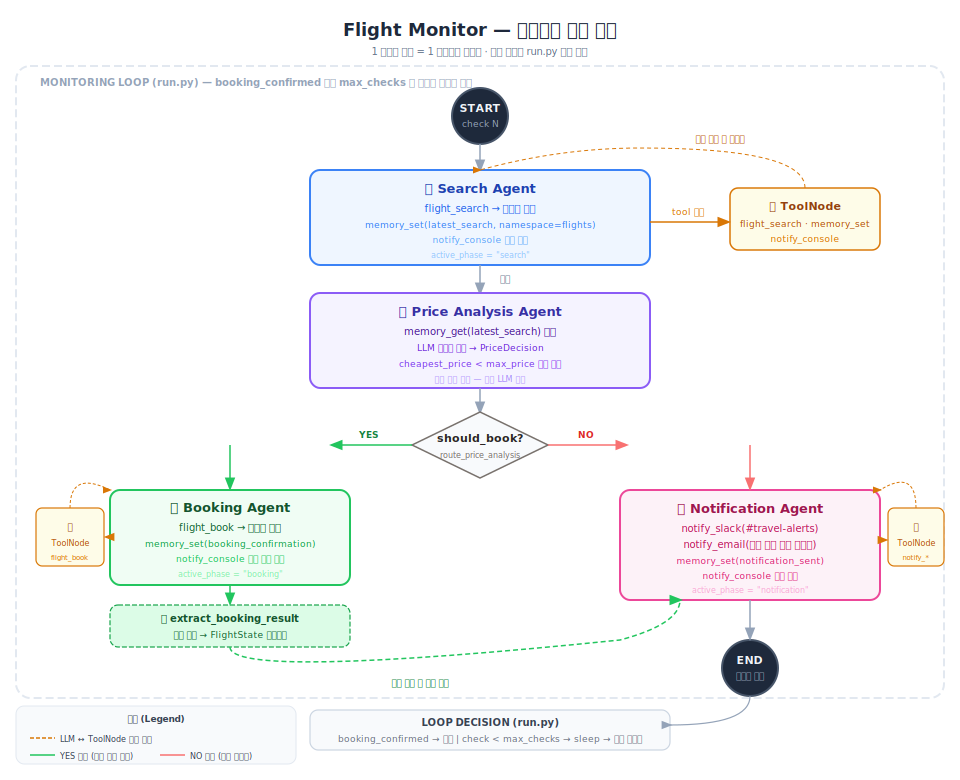

# Flight Monitor

값싼 항공권이 나타날 때까지 주기적으로 가격을 모니터링하다가, 임계값 이하 가격이 감지되면 **자동 예약 + Slack/이메일 알림**을 전송하는 4-에이전트 시스템입니다.

두 가지 모드를 지원합니다:
- **mock** (기본값) — 로컬 MockFlightAPI 서버, 설정 없이 즉시 실행
- **amadeus** — 실제 [Amadeus for Developers](https://developers.amadeus.com) REST API



---

## 아키텍처

### 범용 그래프와의 차이

이 프로젝트에는 두 종류의 LangGraph 그래프가 있습니다.

| | 범용 그래프 (`graph/workflow.py`) | flight_monitor (`examples/flight_monitor/workflow.py`) |
|---|---|---|
| **사용 예시** | customer_support, research, monitoring | flight_monitor 전용 |
| **구조** | Planner → Executor → Reviewer (루프·피드백) | 4개 전문 에이전트 (조건 분기) |
| **Reviewer** | 있음 — 품질 검토 후 재실행 가능 | 없음 — 각 에이전트가 단일 역할만 수행 |
| **분기** | APPROVED / REVISION NEEDED | should_book True / False |

flight_monitor는 "범용 프레임워크를 쓰지 않고 도메인에 맞게 그래프를 직접 설계"한 예시입니다.

---

### 1 사이클 = 1 모니터링 체크

LangGraph 그래프는 **체크 한 번**(START → END)만 담당합니다.
`run.py`의 Python 루프가 그래프를 반복 호출하며 모니터링을 이어갑니다.

```
run.py (Python for 루프)
│
├── check 1 → app.invoke() → 그래프 실행 → END  →  no deal, sleep
├── check 2 → app.invoke() → 그래프 실행 → END  →  no deal, sleep
├── check 3 → app.invoke() → 그래프 실행 → END  →  ✅ BOOKED → break
│
└── 그래프는 "지금 싸냐"만 판단, 반복 주기는 모름
```

이 분리 덕분에 그래프를 독립적으로 테스트하거나 다른 스케줄러(APScheduler 등)로 교체하기 쉽습니다.

---


**LLM ↔ ToolNode 루프:** LLM이 응답에 `tool_calls`를 포함하면 ToolNode로 이동하고, ToolNode가 실행 결과를 돌려주면 LLM이 다시 호출됩니다. 이 사이클은 LLM이 `tool_calls` 없이 일반 텍스트만 반환할 때까지 반복됩니다.

```
search 노드 내부 한 사이클 예시:
  LLM 호출 → AIMessage(tool_calls=[flight_search(...)]) → ToolNode 실행
           → ToolMessage(검색 결과 JSON)                → LLM 재호출
           → AIMessage(tool_calls=[memory_set(...)])    → ToolNode 실행
           → ToolMessage("stored")                     → LLM 재호출
           → AIMessage("SEARCH_DONE: check=3 ...")      → tool_calls 없음 → 종료
```

**`active_phase` 라우팅:** ToolNode는 어느 에이전트가 자신을 호출했는지 모릅니다. 각 에이전트가 `FlightState.active_phase`를 자신의 이름으로 설정해두면, ToolNode 완료 후 라우터가 이 값을 보고 원래 에이전트로 돌아갑니다.

---

### 4-Agent 구성 (Principle of Least Privilege)

각 에이전트는 자신의 역할에 필요한 tool만 접근합니다.

| 에이전트 | 역할 | 전용 Tool | LLM 사용 방식 |
|----------|------|-----------|--------------|
| `SearchAgent` | 항공권 검색, 결과를 memory에 저장 | `flight_search`, `memory_set`, `notify_console` | tool 호출 |
| `PriceAnalysisAgent` | 가격 vs 임계값 비교, 예약 여부 결정 | (없음) | Pydantic Structured Output |
| `BookingAgent` | 예약 실행, 확인서 저장 | `flight_book`, `memory_set`, `notify_console` | tool 호출 |
| `NotificationAgent` | Slack + 이메일 알림 발송 | `notify_slack`, `notify_email`, `notify_console`, `memory_set` | tool 호출 |

`PriceAnalysisAgent`만 tool을 호출하지 않습니다. MemoryMCP에서 검색 결과를 직접 읽어 `_PriceDecision` 스키마로 구조화된 결과를 반환합니다. tool 호출 없이 의사결정만 하므로 LLM 왕복이 1번으로 끝납니다.

---

### 실행 경로 트레이스

**경로 A — 딜 없음 (most checks):**

```
① search    : flight_search → 결과 저장 → "SEARCH_DONE: cheapest=$347"
② analysis  : 메모리 읽기 → should_book=False (347 > 280)
③ notification: notify_console("no deal") → "NOTIFICATION_SENT: skipped"
④ END
```

**경로 B — 딜 발견 (cheap_on_checks 해당 체크):**

```
① search    : flight_search → 결과 저장 → "SEARCH_DONE: cheapest=$198"
② analysis  : 메모리 읽기 → should_book=True (198 < 280)
③ booking   : flight_book → 확인서 저장 → "BOOKING_CONFIRMED: ref=AGNT48271"
④ extract   : 메모리에서 booking_reference, confirmed_price, booking_url 읽어 state 갱신
⑤ notification: notify_slack + notify_email → "NOTIFICATION_SENT: booked"
⑥ END  →  run.py가 booking_confirmed=True 확인 → 루프 종료
```

---

## 파일 구성

| 파일 | 역할 |
|------|------|
| `run.py` | 모니터링 루프 진입점, CLI 파싱, 모드별 클라이언트 설정 |
| `workflow.py` | LangGraph `StateGraph` 빌더, 라우팅 로직 |
| `agents.py` | 4개 에이전트 노드 함수, `extract_booking_result` |
| `state.py` | `FlightState` TypedDict 정의 |
| `mock_api.py` | Mock 항공권 검색/예약 HTTP 서버 (`ThreadingHTTPServer`) |
| `mcp/flight.py` | 항공 API 클라이언트 추상화 (Base / Mock / Amadeus) |
| `tools/flight_tools.py` | `flight_search`, `flight_book` LangChain tool 래퍼 |

---

## 실행

### Mock 모드 (기본값 — 설정 없이 바로 실행)

```bash
python -m examples.flight_monitor.run
```

기본 설정: `ICN → NRT`, 임계값 `$280`, 최대 10회 체크, 3번째·7번째에서 딜 발생.

```bash
# 커스텀 설정
python -m examples.flight_monitor.run \
  --origin ICN \
  --dest BKK \
  --date 2026-08-01 \
  --max-price 350 \
  --interval 5 \
  --max-checks 8 \
  --cheap-on 2 5
```

### Live 모드 — Amadeus (실제 항공 데이터)

#### Amadeus란?

Amadeus는 항공·여행 업계의 글로벌 IT 기업으로, 항공사·호텔·렌터카 예약 시스템의 핵심 인프라를 운영합니다.
대한항공·아시아나·제주항공 등 대부분의 항공사 재고가 Amadeus GDS(Global Distribution System)를 통해 공급되며, 스카이스캐너·네이버 항공권 같은 서비스들이 내부적으로 Amadeus 데이터를 사용합니다.

[Amadeus for Developers](https://developers.amadeus.com) 플랫폼을 통해 REST API를 무료로 제공합니다.

| 환경 | 비용 | 설명 |
|------|------|------|
| **Test** | 무료 | 실제와 유사한 항공 데이터, 예약은 가상 처리 |
| **Production** | 유료 | 실제 항공권 예약 가능 |

이 프로젝트에서 사용하는 API:
- `GET /v2/shopping/flight-offers` — 실제 항공권 검색 (가격·스케줄)
- `POST /v1/security/oauth2/token` — OAuth2 인증 토큰 발급

---

**1단계: Amadeus 계정 생성 (무료)**
1. [developers.amadeus.com](https://developers.amadeus.com) → Sign Up → My Apps → Create New App
2. Test 환경의 `Client ID` + `Client Secret` 확인

**2단계: 자격증명 설정 (둘 중 하나)**

```bash
# 방법 A — .env 파일
AMADEUS_CLIENT_ID=your_client_id
AMADEUS_CLIENT_SECRET=your_client_secret

# 방법 B — 암호화 auth vault에 저장 (권장)
python -c "
from tools.auth_tools import auth_store_key
auth_store_key.invoke({'service': 'amadeus', 'key': 'your_client_id:your_client_secret'})
"
```

**3단계: 실행**

```bash
# .env 자격증명 사용
python -m examples.flight_monitor.run --mode amadeus --origin ICN --dest NRT --date 2026-07-15

# auth vault 자격증명 사용
python -m examples.flight_monitor.run --mode amadeus --amadeus-key amadeus
```

> **Live 모드의 예약 동작**: Amadeus 실제 예약(`/v1/booking/flight-orders`)은 여권·결제 정보가 필요합니다. 이 시스템은 딜을 감지하면 **Google Flights 딥 링크 + 알림**을 생성합니다. 사용자가 링크를 통해 직접 예약을 완료합니다. (대부분의 항공권 알림 서비스와 동일한 방식)

---

## CLI 옵션

| 옵션 | 기본값 | 설명 |
|------|--------|------|
| `--mode` | `mock` | API 백엔드: `mock` 또는 `amadeus` |
| `--origin` | `ICN` | 출발지 IATA 코드 |
| `--dest` | `NRT` | 목적지 IATA 코드 |
| `--date` | `2026-07-15` | 여행 날짜 (YYYY-MM-DD) |
| `--max-price` | `280.0` | 최대 허용 가격 (USD) |
| `--passenger` | `Agentic AI Traveler` | 승객 이름 |
| `--email` | `""` | 승객 이메일 (예약 확인 발송용) |
| `--interval` | `8` | 체크 간격 (초) |
| `--max-checks` | `10` | 최대 체크 횟수 |
| `--cheap-on` | `3 7` | 딜 발생 체크 번호 (Mock 모드 전용) |
| `--amadeus-key` | `amadeus` | auth vault의 Amadeus 자격증명 서비스 이름 |

---

## 출력 예시 (Mock 모드)

```
═════════════════════════════════════════════════════════════════
✈️  FLIGHT MONITOR — AGENTIC AI
═════════════════════════════════════════════════════════════════
  Mode        : MOCK
  Route       : ICN → NRT
  Date        : 2026-07-15
  Max price   : $280.00 USD
  Passenger   : Agentic AI Traveler
  Interval    : every 8s
  Max checks  : 10
  Deal checks : [3, 7] (mock simulation)
═════════════════════════════════════════════════════════════════

─────────────────────────────────────────────────────────────────
  CHECK 1/10  [14:02:03]
─────────────────────────────────────────────────────────────────
  ⏭  No deal this check. Cheapest: $347.21 USD
  ⏳ Next check in 8s...

─────────────────────────────────────────────────────────────────
  CHECK 3/10  [14:02:20]
─────────────────────────────────────────────────────────────────
  ✅ BOOKED! Reference: AGNT48271  Price: $198.45 USD

═════════════════════════════════════════════════════════════════
🎉  MONITORING COMPLETE — BOOKING CONFIRMED!
    Booking reference : AGNT48271
    Final price       : $198.45 USD
    Savings           : ~$81.55 USD
    Found on check    : 3 of 10
═════════════════════════════════════════════════════════════════
```

### Live 모드 출력 (딜 감지 시)

```
  ✅ BOOKED! Reference: DEAL-KE703-20260715  Price: $198.45 USD
  🔗 Complete booking: https://www.google.com/flights#search;iti=ICN*NRT/2026-07-15;tt=o
```

---

## 환경 변수

| 변수 | 기본값 | 설명 |
|------|--------|------|
| `OPENAI_API_KEY` | — | 필수 |
| `FLIGHT_API_MODE` | `mock` | 기본 모드 (`mock` \| `amadeus`) |
| `AMADEUS_CLIENT_ID` | `""` | Amadeus Client ID (live 모드) |
| `AMADEUS_CLIENT_SECRET` | `""` | Amadeus Client Secret (live 모드) |
| `AMADEUS_BASE_URL` | `https://test.api.amadeus.com` | 테스트/운영 URL 전환 |
| `NOTIFICATION_DRY_RUN` | `true` | `true`이면 Slack/이메일 콘솔 출력 |
| `EMAIL_RECIPIENT` | `traveler@example.com` | 예약 확인 이메일 수신자 |

---

## Tool · MCP 조합 구조

이 시나리오의 에이전트들은 **공통 Tool/MCP를 재사용**하고, 항공권 도메인 로직만 별도 Tool로 추가하는 방식으로 구성됩니다.

| 에이전트 | 도구 | 성격 |
|----------|------|------|
| SearchAgent | `flight_search` | 시나리오 전용 (FlightMCP) |
| | `memory_set`, `notify_console` | 공통 MCP |
| PriceAnalysisAgent | (tool 없음 — MemoryMCP 직접 호출) | 공통 MCP |
| BookingAgent | `flight_book` | 시나리오 전용 (FlightMCP) |
| | `memory_get`, `memory_set`, `notify_console` | 공통 MCP |
| NotificationAgent | `notify_slack`, `notify_email`, `notify_console`, `memory_set` | 공통 MCP |

`flight_search` / `flight_book` 도 내부 구조는 공통 패턴을 따릅니다.

```
tools/flight_tools.py  →  mcp/flight.py   →  Mock or Amadeus API
tools/memory_tools.py  →  mcp/memory.py   →  SQLite
tools/notify_tools.py  →  mcp/notification.py  →  Slack / Email / Console
```

도메인이 바뀌어도 Memory·Notification·HTTP·Auth MCP는 그대로 재사용하고,
새 MCP + Tool 하나만 추가하면 새 시나리오를 구성할 수 있습니다.

---

## IATA 코드 조회

`--origin`, `--dest` 옵션에 입력하는 공항 코드는 IATA 3자리 코드입니다.

| 사이트 | 특징 |
|--------|------|
| [IATA 공식](https://www.iata.org/en/publications/directories/code-search/) | IATA 공식 코드 검색 |
| [Our Airports](https://ourairports.com/airports/) | 전 세계 공항 목록, CSV 다운로드 가능 |
| [FlightConnections](https://www.flightconnections.com/) | 지도 기반 노선 탐색 + 코드 확인 |

자주 쓰는 코드:

| 공항 | 코드 |
|------|------|
| 인천국제공항 | `ICN` |
| 김포공항 | `GMP` |
| 나리타공항 (도쿄) | `NRT` |
| 하네다공항 (도쿄) | `HND` |
| 오사카 간사이 | `KIX` |
| 방콕 수완나품 | `BKK` |
| 싱가포르 창이 | `SIN` |
| 홍콩 | `HKG` |
| 뉴욕 JFK | `JFK` |
| 런던 히스로 | `LHR` |
| 파리 샤를드골 | `CDG` |

---

## 주요 설계 포인트

### Flight Client 추상화 (`mcp/flight.py`)

`BaseFlightClient` ABC를 중심으로 Mock과 Amadeus 구현을 교체 가능하게 설계했습니다.

```python
# run.py — 모드에 따라 한 번만 설정
if criteria.mode == "mock":
    configure_flight_client(MockFlightClient(base_url=api.base_url))
else:
    configure_flight_client(AmadeusFlightClient(client_id, client_secret))

# tools/flight_tools.py — 에이전트가 호출하는 도구
@tool
def flight_search(origin, destination, date, max_price, check_number=0) -> str:
    return json.dumps(get_flight_client().search(...).to_dict())
```

에이전트는 `flight_search`/`flight_book`만 알고 백엔드를 알 필요가 없습니다.

### Amadeus OAuth2 토큰 캐싱

`AmadeusFlightClient`가 내부적으로 OAuth2 토큰을 관리합니다. 만료 60초 전에 자동 갱신되므로 에이전트 코드에서 별도 처리가 불필요합니다.

### Pydantic Structured Output (PriceAnalysisAgent)

`PriceAnalysisAgent`는 tool call 없이 `_PriceDecision` 스키마로 의사결정합니다. 불필요한 LLM 왕복을 제거하여 비용과 지연을 절감합니다.

### 단일 ToolNode + `active_phase` 라우팅

하나의 공유 ToolNode가 모든 에이전트의 tool call을 처리합니다. 각 에이전트는 `active_phase` 필드를 설정하여 tool 실행 후 어느 에이전트로 복귀할지 알려줍니다.

### `extract_booking_result` 인라인 상태 갱신

BookingAgent 완료 후 LLM 호출 없이 메모리에서 예약 확인 정보를 읽어 `FlightState`를 갱신합니다. `booking_url` 필드도 여기서 state로 전파되어 NotificationAgent가 딥 링크를 알림에 포함할 수 있습니다.
